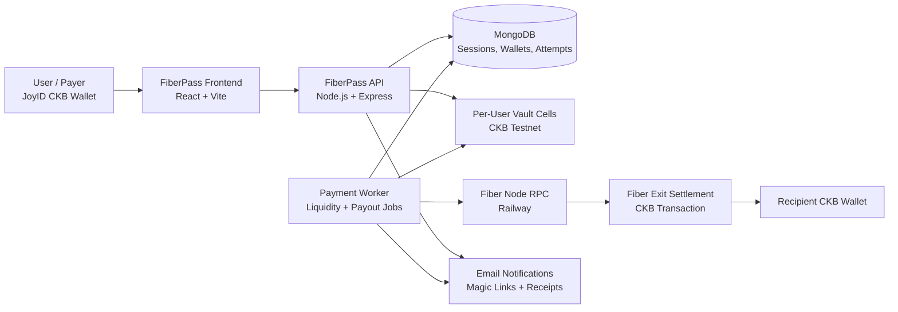
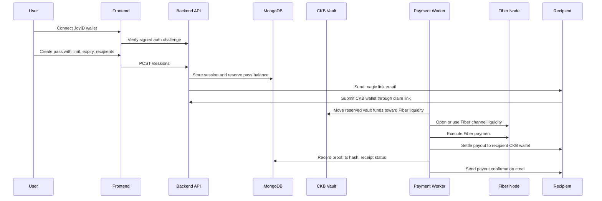

# FiberPass System Design

FiberPass is wallet and payment UX infrastructure for prepaid, revocable Fiber Network payment sessions.

The core idea is simple: a user approves a capped payment pass once, then FiberPass handles balance reservation, Fiber liquidity preparation, payment execution, settlement tracking, and receipts.

## Selected Category

**Category 1: Wallet and Payment UX Infrastructure**

FiberPass abstracts Fiber channel/payment complexity for wallets, apps, merchants, subscriptions, and invoice-style payouts.

## High-Level Architecture

## Payment Flow

## Main User Flows

### 1. Wallet Authentication

- User connects a JoyID CKB wallet.
- Backend issues a challenge.
- User signs the challenge.
- Backend verifies ownership and creates an authenticated API session.

### 2. Vault Funding

- User creates or confirms a funding request.
- Backend derives the logged-in user's vault address.
- CKB testnet activity is synced and reconciled.
- The dashboard shows the user's own FiberPass available balance, not cumulative vault funds.

### 3. Pass Creation

User creates a pass with:

- spending limit;
- expiry time;
- payment type;
- recipient names, emails, addresses, or claim links;
- schedule or payout date;
- optional reference and condition summary.

The backend reserves the pass limit from the user's FiberPass available balance.

### 4. Recipient Claim

- Recipient receives a magic link.
- Recipient submits a CKB wallet address.
- Backend stores recipient details and timezone.
- The pass can execute automatically when due.

### 5. Automated Payout

- Payment worker scans due sessions.
- Worker prepares Fiber liquidity from reserved vault funds.
- Worker executes the Fiber payment through the configured Fiber RPC node.
- Fiber exit settlement sends CKB to the recipient wallet.
- Backend records attempts, proofs, settlement tx hash, and explorer link.
- Recipient receives a confirmation email.

### 6. Pass Controls

Users can:

- pause;
- resume;
- revoke;
- top up;
- close or settle;
- inspect details, attempts, failures, transaction hashes, receipts, and logs.

## Developer Flows

### Session API

The backend exposes APIs for:

- creating sessions;
- listing active/history sessions;
- funding and syncing vault balance;
- claiming recipient wallet details;
- pausing, revoking, topping up, and settling passes;
- checking Fiber node readiness;
- tracking app/API charge attempts.

### Worker Flow

The payment worker handles:

- scheduled liquidity preparation;
- retrying pending CKB confirmations or Fiber channel states;
- executing due payouts;
- recording failure reasons;
- sending payout receipt emails.

### Fiber Readiness

The Fiber readiness layer reports:

- RPC reachability;
- node identity;
- connected peers;
- active channels;
- outbound capacity;
- payment execution readiness.

This helps wallets and operators diagnose payment readiness before a user-facing payout fails.

## Data Model Summary

| Model | Purpose |
| --- | --- |
| Wallet | Authenticated JoyID wallet, available balance, vault identity |
| Session | Pass limit, expiry, recipients, status, policy, Fiber state |
| Recipient Wallet | Recipient email/address, claim status, payout status, tx proof |
| Charge Attempt | Every payment attempt, success/failure, proof, error reason |
| Funding Request | User vault funding request and confirmation status |
| Audit Log | Operational events for review and debugging |

## Infrastructure Components

| Component | Stack / Tooling |
| --- | --- |
| Frontend | React, TypeScript, Vite, Tailwind CSS |
| Backend API | Node.js, Express, TypeScript |
| Database | MongoDB + Mongoose |
| Wallet Auth | JoyID CKB |
| CKB Tooling | Lumos, CKB testnet RPC/indexer |
| Fiber Node | Fiber RPC node deployed on Railway |
| Worker | Node.js payment worker on Railway |
| Hosting | Vercel for frontend/backend API |
| Email | SMTP for magic links and receipts |

## Why This Matters For Fiber

Fiber Network gives CKB fast, low-cost payment channels, but wallets and apps still need infrastructure around repeated payments.

FiberPass provides that missing session layer:

- users approve a bounded pass once;
- apps and scheduled flows can pay automatically within rules;
- Fiber liquidity preparation is hidden from the user;
- failures are recorded in product-readable language;
- receipts and settlement proofs are available to both payer and recipient.

This makes Fiber easier to integrate into wallets, merchant flows, subscriptions, invoice payments, and AI/API usage billing.

## Current Demo Capability

The deployed demo currently supports:

- JoyID CKB login;
- user vault funding and balance reconciliation;
- prepaid pass creation;
- recipient magic links;
- scheduled single or multi-recipient payouts;
- vault-funded Fiber liquidity preparation;
- Fiber payment execution;
- CKB recipient settlement;
- transaction hash and explorer links;
- payout receipt emails;
- pass history and detailed payment attempts.

## Future Work

- Drop-in wallet/app SDK.
- Hosted payment-session modal.
- Merchant webhooks and reconciliation exports.
- Route confidence and liquidity diagnostics.
- Stablecoin / RGB++ payment pass support.
- LSP-style liquidity quote and routing integrations.
